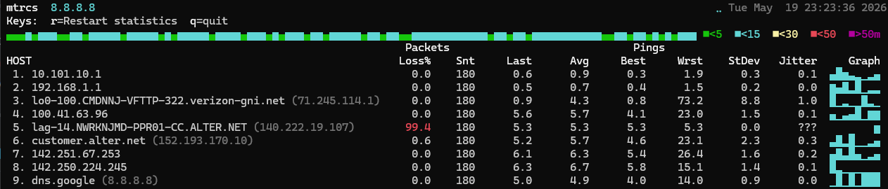

<div align="center">

```
╔╦╗╔╦╗╦═╗╔═╗╔═╗
║║║ ║ ╠╦╝║  ╚═╗
╩ ╩ ╩ ╩╚═╚═╝╚═╝
```

# MTRCS

**My Traceroute — rewritten in C#. Truly cross-platform. Blazing fast. Native AOT.**

[](https://github.com/irperez/MTRCS/actions/workflows/ci.yml)
[](https://github.com/irperez/MTRCS/actions/workflows/release.yml)
[](https://github.com/irperez/MTRCS/releases/latest)
[](LICENSE)
[](https://dotnet.microsoft.com)
[](#-installation)

</div>

---

> **MTRCS** is a from-scratch C# rewrite of the classic [`mtr`](https://www.bitwizard.nl/mtr/) network diagnostic tool.  
> It combines the functionality of `traceroute` and `ping` into a single, continuously-updating terminal display — now with native binaries for **every major platform**, zero runtime dependencies, and a clean modern codebase.

---

## 🖥️ Live Demo

The live view is a full-screen terminal UI that updates ~10 times per second. Here is what it looks like in practice:



**UI anatomy:**

| Area | Description |
|------|-------------|
| **Title line** | `mtrcs  <host> (<resolved IP>)` on the left; spinner (`⠉⠘⠰⢠⣀⡄⠆⠃`) + live clock (`Tue May 19 22:01:54 2026`) on the right |
| **Keys bar** | Keyboard shortcuts — `r` restarts statistics, `q` quits |
| **Header graph** | Full-width scrolling latency bar chart for the destination hop; color-coded by RTT tier with legend |
| **Color legend** | `■<5  ■<15  ■<30  ■<50  ■>50ms` — thresholds match `--graph-green/cyan/yellow/red` defaults; customizable |
| **Column headers** | `Packets` group (Loss%, Snt) and `Pings` group (Last, Avg, Best, Wrst, StDev, Jitter, Graph) |
| **Per-hop rows** | One row per TTL; long hostnames are truncated with `...` |
| **Graph column** | 8-column Unicode sparkline (▁▂▃▄▅▆▇█) showing the rolling RTT history for that hop |
| **Loss highlight** | Loss% is shown in **red** when at or above `--crit-loss` (default 10%), **yellow** at `--warn-loss` (default 1%) |
| **`???` hops** | Hops that return no ICMP response — Loss% shown in red, RTT columns display `???` |

*Press `Ctrl+C` or `q` to exit. The display refreshes ~10×/sec for real-time visibility.*

---

## ✨ Features

| Feature | Details |
|---------|---------|
| 🔄 **Live mode** | Continuously-updating terminal UI, ~10 Hz refresh |
| 📊 **Report mode** | Run N cycles, print results, and exit — scriptable |
| 🌐 **Multi-protocol** | ICMP Echo (default), TCP SYN (`-T`), UDP (`-u`) |
| 🏷️ **ASN lookup** | Autonomous System Number via Team Cymru DNS (`-a`) |
| 📤 **Export** | Save results as `text`, `csv`, or `json` (`-o`/`-f`) |
| ⚡ **Native AOT** | Zero-dependency single binary — no .NET runtime needed |
| 🌍 **Cross-platform** | Windows, macOS, Linux, Raspberry Pi — one codebase |
| 🎨 **Rich ANSI UI** | Color-coded RTT/loss, alternate screen buffer, zero flicker |
| 🔬 **Precise stats** | Welford online algorithm for numerically stable mean/stdev |
| 📦 **Self-contained** | No install — just download and run |
| 6️⃣ **IPv6 support** | Prefer IPv6 when resolving hostnames (`-6`/`--ipv6`) |
| 📈 **Percentiles** | Optional P95 and P99 RTT columns (`--percentiles`) |
| 🎚️ **Alert thresholds** | Configurable warn/crit colors for loss % and avg RTT |
| 🎨 **Graph color tiers** | Fully customizable latency bar-chart color thresholds |
| 🔇 **Warmup control** | Silent first-cycle warmup discards cold-start RTT by default (`--no-warmup` to disable) |
| 🏷️ **DSCP/QoS tagging** | Set DSCP value in probe packets for QoS path verification (`--dscp`) |

---

## 📦 Installation

### Option 1 — Prebuilt Binaries (Recommended)

Download the latest release for your platform from [**Releases**](https://github.com/irperez/MTRCS/releases/latest):

| Platform | Download | Notes |
|----------|----------|-------|
| 🪟 Windows x64 | `mtrcs-vX.Y.Z-win-x64.zip` | Native AOT, no runtime needed |
| 🍎 macOS Apple Silicon | `mtrcs-vX.Y.Z-osx-arm64.tar.gz` | Native AOT, M1/M2/M3/M4 |
| 🐧 Linux x64 | `mtrcs-vX.Y.Z-linux-x64.tar.gz` | Native AOT |
| 🐧 Linux ARM64 | `mtrcs-vX.Y.Z-linux-arm64.tar.gz` | Native AOT, Pi 4/5 (64-bit) |
| 🫐 Raspberry Pi (ARMv7) | `mtrcs-vX.Y.Z-linux-arm.tar.gz` | Self-contained, Pi 1/2/3/Zero |

#### Linux / macOS

```bash
# Download and extract (replace X.Y.Z with the actual version)
curl -fsSL https://github.com/irperez/MTRCS/releases/latest/download/mtrcs-vX.Y.Z-linux-x64.tar.gz | tar -xz

# Make executable and install system-wide
chmod +x mtrcs
sudo mv mtrcs /usr/local/bin/

# Verify
mtrcs --version
```

> **Note for macOS:** On first launch, macOS may quarantine the binary. Remove the quarantine flag with:
> ```bash
> xattr -d com.apple.quarantine ./mtrcs
> ```

#### Windows

```powershell
# Extract the zip, then run from PowerShell or cmd
.\mtrcs.exe --version
```

> **Windows note:** Raw ICMP sockets require elevated privileges. Run your terminal as **Administrator** or use TCP/UDP probe mode (`-T` or `-u`).

#### Raspberry Pi

```bash
# ARM64 (Pi 4, Pi 5, Pi Zero 2W in 64-bit mode)
curl -fsSL https://github.com/irperez/MTRCS/releases/latest/download/mtrcs-vX.Y.Z-linux-arm64.tar.gz | tar -xz

# ARMv7 (Pi 1, Pi 2, Pi 3, Pi Zero, Pi Zero W)
curl -fsSL https://github.com/irperez/MTRCS/releases/latest/download/mtrcs-vX.Y.Z-linux-arm.tar.gz | tar -xz

chmod +x mtrcs
sudo mv mtrcs /usr/local/bin/
```

---

### Option 2 — Build from Source

**Prerequisites:** [.NET 10 SDK](https://dotnet.microsoft.com/download/dotnet/10.0)

```bash
git clone https://github.com/irperez/MTRCS.git
cd MTRCS/MTRCSLib

# Run the console app directly
dotnet run --project MTRCS -- google.com

# Publish a self-contained binary for your current platform
dotnet publish MTRCS/MTRCS.csproj -c Release --self-contained -r linux-x64 -o out/
./out/mtrcs google.com
```

---

## 🚀 Usage

### Basic Syntax

```
mtrcs <host> [options]
```

### Live Mode (default)

Starts a continuously-updating display, refreshing ~10 times per second.  
Press **`Ctrl+C`** to stop.

```bash
# Trace to a hostname
mtrcs google.com

# Trace to an IP
mtrcs 8.8.8.8

# Custom hop limit and interval
mtrcs example.com --max-hops 20 --interval 500

# Include ASN information (who owns each hop's IP)
mtrcs cloudflare.com --asn
```

### Report Mode

Run a fixed number of probe cycles, print the final statistics, then exit.  
Ideal for scripting, monitoring, and automation.

```bash
# Run 10 cycles (default) and print report
mtrcs google.com --report

# Run 30 cycles for a more statistically meaningful result
mtrcs 8.8.8.8 --report --cycles 30

# Save report to a file
mtrcs google.com --report --output /tmp/report.txt

# Export as CSV
mtrcs google.com --report --output results.csv --format csv

# Export as JSON (great for ingestion into dashboards)
mtrcs google.com --report --output results.json --format json
```

#### Sample JSON output

```json
{
  "host": "google.com",
  "target": "142.250.80.46",
  "generated": "2026-05-17T04:00:00+00:00",
  "hops": [
    {
      "hop": 1,
      "ip": "192.168.1.1",
      "host": "router.local",
      "loss": 0.0,
      "snt": 10,
      "last": 1.2,
      "avg": 1.3,
      "best": 0.9,
      "wrst": 2.1,
      "stDev": 0.3,
      "jitter": 0.2
    }
  ]
}
```

---

## ⚙️ Options Reference

| Option | Short | Default | Description |
|--------|-------|---------|-------------|
| `<host>` | — | *(required)* | Hostname, IPv4, or IPv6 address to trace |
| `--max-hops` | `-m` | `30` | Maximum TTL hops (1–255) |
| `--interval` | `-i` | `1000` | Probe cycle interval in milliseconds |
| `--timeout` | `-t` | `800` | Per-probe timeout in milliseconds |
| `--size` | `-s` | `28` | ICMP payload size in bytes |
| `--report` | `-r` | `false` | Enable report mode (run N cycles and exit) |
| `--cycles` | `-c` | `10` | Number of cycles to run in report mode |
| `--asn` | `-a` | `false` | Show ASN column (Team Cymru DNS lookup) |
| `--tcp` | `-T` | `false` | Use TCP SYN probes instead of ICMP |
| `--udp` | `-u` | `false` | Use UDP probes instead of ICMP |
| `--ipv6` | `-6` | `false` | Prefer IPv6 when resolving hostnames (falls back to IPv4) |
| `--port` | `-P` | `80`/`33434` | Destination port for TCP/UDP probes |
| `--output` | `-o` | — | File path for report export (requires `--report`) |
| `--format` | `-f` | `text` | Export format: `text`, `csv`, `json` |
| `--warn-loss` | — | `1` | Loss % threshold for yellow highlight |
| `--crit-loss` | — | `10` | Loss % threshold for red highlight |
| `--warn-rtt` | — | `0` (off) | Avg RTT (ms) threshold for yellow highlight |
| `--crit-rtt` | — | `0` (off) | Avg RTT (ms) threshold for red highlight |
| `--graph-green` | — | `5` | RTT (ms) below which latency bar chart bars are green |
| `--graph-cyan` | — | `15` | RTT (ms) below which latency bar chart bars are cyan |
| `--graph-yellow` | — | `30` | RTT (ms) below which latency bar chart bars are yellow |
| `--graph-red` | — | `50` | RTT (ms) below which latency bar chart bars are red (above = magenta) |
| `--no-warmup` | — | `false` | Include the first probe cycle in stats (disables silent cold-start warmup) |
| `--percentiles` | — | `false` | Show P95 and P99 RTT columns in the live view and reports |
| `--dscp` | — | `0` | Set DSCP value (0–63) in probe packets for QoS path verification |
| `--version` | — | — | Show version and exit |
| `--help` | `-h` | — | Show help and exit |

---

## 📊 Understanding the Output

```
mtrcs  google.com (142.250.191.14)                          ⠘  Tue May 19 22:01:54 2026
Keys:  r=Restart statistics   q=quit
▁▂▁▂▁▂▃▂▁▂▁▃▂▁▂▁▃▂▁▂▁▂▃▁▂▁▂▁▃▂▁▂▁▂▃▂▁▂▁▂▁▃▂▁▂▁▂▃▂▁▂▁    ■<5  ■<15  ■<30  ■<50  ■>50ms

                          Packets                          Pings
HOST                       Loss%    Snt    Last     Avg    Best    Wrst   StDev  Jitter  Graph
 1. 10.101.10.1              0.0      9     0.9     0.7     0.4     1.1     0.2     0.0  ▃▂▃▂▃▃▂▃
 2. 192.168.1.1              0.0      9     0.6     0.7     0.5     1.0     0.2     0.2  ▂▂▂▂▂▂▂▂
 5. ???                    100.0      8     ???     ???     ???     ???     ???     ???  –
 6. customer.alter.net (204.148.5.98)
                            12.5      8     6.5     6.1     5.5     6.5     0.4     0.7  ▃▃▃▃▂▃▃▃
```

### Column reference

| Column | Meaning |
|--------|---------|
| **HOST** | Hop number, reverse-DNS hostname, and IP address; long names are truncated with `…` |
| **Loss%** | Percentage of probes that received no response; yellow at `--warn-loss`, red at `--crit-loss` |
| **Snt** | Total probes sent to this hop |
| **Last** | RTT of the most recent probe (ms) |
| **Avg** | Running arithmetic mean of all RTT samples (ms) |
| **Best** | Minimum RTT ever observed (ms) |
| **Wrst** | Maximum RTT ever observed (ms) |
| **StDev** | Standard deviation of RTT — indicates jitter/instability (ms) |
| **Jitter** | Absolute difference between the last two RTT samples (ms) |
| **Graph** | 8-column rolling sparkline (▁▂▃▄▅▆▇█) — each bar represents one ping cycle; taller = higher RTT |
| **P95 / P99** | 95th and 99th percentile RTT columns, shown when `--percentiles` is passed |
| **ASN** | Autonomous System Number and name, shown when `--asn` is passed |

### Header latency graph

The third line is a full-width scrolling bar chart for the **destination hop**. One column is appended per ping cycle and the chart scrolls left as new data arrives. Columns are color-coded by RTT tier:

| Color | Default threshold | Option |
|-------|------------------|--------|
| 🟢 Green | < 5 ms | `--graph-green` |
| 🩵 Cyan | < 15 ms | `--graph-cyan` |
| 🟡 Yellow | < 30 ms | `--graph-yellow` |
| 🔴 Red | < 50 ms | `--graph-red` |
| 🟣 Magenta | ≥ 50 ms | *(above `--graph-red`)* |

The compact legend on the right (`■<5  ■<15  ■<30  ■<50  ■>50ms`) reflects the active threshold values.

### Spinner and clock

The top-right corner shows a **braille spinner** (`⠉⠘⠰⢠⣀⡄⠆⠃`) that ticks every frame to confirm the tool is running, followed by the **live local date and time** (`Tue May 19 22:01:54 2026`). If the spinner freezes, the probe loop has stalled.

### Reading the numbers

- **High Loss% at intermediate hops** — Routers often rate-limit ICMP. If the *final destination* shows 0% loss, intermediate loss is usually benign.
- **`???` hops** — No successful probe received; Loss% is shown in red and RTT columns display `???`.
- **High StDev / Wrst** — Indicates bursty congestion or route instability.
- **Rising Avg over time** — Sustained congestion or a degrading link.
- **Flat sparkline** — Consistent RTT; a growing or spiking sparkline suggests instability.

---

## 🌐 Probe Modes

MTRCS supports three probe protocols, letting you work around firewalls that block ICMP.

### ICMP (default)

Standard ICMP Echo probes — the same as traditional `ping` and `mtr`.

```bash
mtrcs google.com
```

> Requires raw socket privileges. On Linux/macOS: run with `sudo` or set `CAP_NET_RAW`. On Windows: run as Administrator.

### TCP SYN (`--tcp` / `-T`)

Sends TCP SYN packets to the destination port. Works through firewalls that permit outbound TCP.

```bash
# Default port: 80
mtrcs example.com --tcp

# Custom port (e.g., HTTPS)
mtrcs example.com --tcp --port 443
```

### UDP (`--udp` / `-u`)

Sends UDP packets. Compatible with many corporate firewalls and VPN environments.

```bash
# Default port: 33434
mtrcs example.com --udp

# Custom port
mtrcs example.com --udp --port 33434
```

> **Note:** `--tcp` and `--udp` are mutually exclusive.

---

## 🌍 IPv6 Support (`--ipv6` / `-6`)

The `--ipv6` flag instructs MTRCS to prefer an IPv6 address when resolving a hostname. If the hostname has no AAAA record, it falls back to IPv4 automatically.

```bash
mtrcs google.com --ipv6
mtrcs google.com -6
```

---

## 📈 Percentiles (`--percentiles`)

Show additional **P95** and **P99** RTT columns in both the live view and exported reports. Useful for spotting tail latency that the average and worst columns can miss.

```bash
mtrcs google.com --percentiles
mtrcs google.com --report --cycles 50 --percentiles --output report.json --format json
```

---

## 🚦 Alert Thresholds

Color-code the **Loss%** and **Avg RTT** columns based on configurable warn/crit boundaries.

| Option | Default | Behavior |
|--------|---------|----------|
| `--warn-loss <pct>` | `1` | Loss% ≥ value → **yellow** |
| `--crit-loss <pct>` | `10` | Loss% ≥ value → **red** |
| `--warn-rtt <ms>` | `0` (off) | Avg RTT ≥ value → **yellow** |
| `--crit-rtt <ms>` | `0` (off) | Avg RTT ≥ value → **red** |

```bash
# Highlight hops with >5% loss in red and RTT >150 ms in red
mtrcs example.com --crit-loss 5 --warn-rtt 50 --crit-rtt 150
```

---

## 🎨 Graph Color Tiers (`--graph-*`)

The header latency bar chart uses five color tiers (green → cyan → yellow → red → magenta). Each `--graph-*` option sets the **exclusive upper bound** (in ms) for that tier.

| Option | Default | Meaning |
|--------|---------|---------|
| `--graph-green <ms>` | `5` | RTT below this → green |
| `--graph-cyan <ms>` | `15` | RTT below this → cyan |
| `--graph-yellow <ms>` | `30` | RTT below this → yellow |
| `--graph-red <ms>` | `50` | RTT below this → red; at or above → magenta |

```bash
# Tighter thresholds for a low-latency LAN environment
mtrcs example.com --graph-green 2 --graph-cyan 5 --graph-yellow 15 --graph-red 30

# Looser thresholds for high-latency intercontinental links
mtrcs example.com --graph-green 30 --graph-cyan 80 --graph-yellow 150 --graph-red 250
```

---

## 🔇 Warmup Suppression (`--no-warmup`)

By default, MTRCS runs a silent warmup cycle before recording any statistics. This discards the inflated cold-start RTT caused by ARP resolution, routing-cache misses, and OS socket setup, giving you cleaner baselines immediately.

Pass `--no-warmup` to include the very first probe cycle in all charts and statistics:

```bash
mtrcs example.com --no-warmup
```

---

## 🏷️ DSCP / QoS Tagging (`--dscp`)

Set the **DSCP** (Differentiated Services Code Point) field (0–63) in outgoing probe packets. This lets you verify that QoS policies are being applied end-to-end and that prioritized traffic follows the expected path.

Common DSCP values:

| Value | Class | Typical use |
|-------|-------|-------------|
| `0` | Best Effort (BE) | Default |
| `8` | CS1 | Background |
| `46` | EF (Expedited Forwarding) | VoIP / real-time |
| `34` | AF41 | Video conferencing |

```bash
# Trace the VoIP traffic path (EF / DSCP 46)
mtrcs sip.example.com --dscp 46

# Verify best-effort path
mtrcs example.com --dscp 0
```

> **Note:** Setting DSCP requires raw socket privileges (same as ICMP mode). The receiving hop may or may not honor or preserve the DSCP marking.

---

## 🔍 ASN Lookup (`--asn`)

The `--asn` flag enriches each hop with its Autonomous System Number and description, powered by a DNS lookup against [Team Cymru's](https://www.team-cymru.com/ip-asn-mapping) IP-to-ASN mapping service.

```bash
mtrcs 8.8.8.8 --asn
```

```
HOST                                       Loss%    Snt    Last     Avg    Best    Wrst   StDev  Jitter  ASN
 1. router.local (192.168.1.1)               0.0%    42     1.2     1.3     0.9     2.1     0.3     0.2  ...
 2. 100.64.0.1                               0.0%    42     8.4     8.7     7.8     9.2     0.4     0.3  AS7922 COMCAST
 3. 96.110.41.181                            0.0%    42    11.1    11.4    10.7    13.0     0.5     0.4  AS7922 COMCAST
 4. 68.86.143.97                             0.0%    42    14.0    14.3    13.6    15.8     0.6     0.5  AS7922 COMCAST
 5. 108.170.246.33                           0.0%    42    15.2    15.4    14.9    16.2     0.3     0.2  AS15169 GOOGLE
 6. 142.250.57.197                           0.0%    42    15.8    16.0    15.3    17.4     0.5     0.4  AS15169 GOOGLE
 7. dns.google (8.8.8.8)                     0.0%    42    16.0    16.2    15.7    17.8     0.4     0.3  AS15169 GOOGLE
```

---

## 🛠️ Scripting & Automation Examples

```bash
# Run in report mode and capture exit code (0 = success)
mtrcs 8.8.8.8 --report --cycles 5
echo "Exit: $?"

# Pipe JSON output to jq for analysis
mtrcs google.com --report --cycles 20 --output /dev/stdout --format json 2>/dev/null \
  | jq '.hops[] | select(.loss > 5) | {hop, host, loss}'

# Cron-friendly: save timestamped report
mtrcs 8.8.8.8 --report --cycles 30 \
  --output "/var/log/network/mtrcs-$(date +%Y%m%d-%H%M%S).csv" \
  --format csv

# Network health check script
mtrcs 1.1.1.1 --report --cycles 10 --output report.json --format json
LOSS=$(jq '[.hops[-1].loss] | .[0]' report.json)
if (( $(echo "$LOSS > 5" | bc -l) )); then
  echo "⚠️  High loss detected: ${LOSS}%"
fi
```

---

## 🔒 Permissions

| Platform | ICMP | TCP/UDP |
|----------|------|---------|
| Linux | `sudo` or `CAP_NET_RAW` capability | No extra permissions needed |
| macOS | `sudo` | No extra permissions needed |
| Windows | Run as Administrator | No extra permissions needed |
| Raspberry Pi | `sudo` or `CAP_NET_RAW` | No extra permissions needed |

### Linux: Grant CAP_NET_RAW (avoid sudo)

```bash
sudo setcap cap_net_raw+ep /usr/local/bin/mtrcs
mtrcs google.com  # no sudo needed
```

---

## 🏗️ Architecture

MTRCS is structured as three projects in one solution:

```
MTRCSLib/
├── MTRCSLib/          # Core library — probing engine, stats, DNS, ASN
│   ├── TracerouteSession.cs     # Orchestrates the probe loop
│   ├── SystemPinger.cs          # ICMP prober (raw sockets)
│   ├── TcpPinger.cs             # TCP SYN prober
│   ├── UdpPinger.cs             # UDP prober
│   ├── HopStats.cs              # Per-hop statistics (Welford algorithm)
│   ├── CymruAsnResolver.cs      # Team Cymru ASN lookup
│   └── TracerouteOptions.cs     # Immutable configuration
│
├── MTRCS/             # Console application (CLI entry point)
│   ├── Program.cs               # Spectre.Console CLI setup
│   ├── MtrCommand.cs            # Main command — live & report modes
│   ├── MtrAnsiRenderer.cs       # Zero-alloc live ANSI renderer
│   ├── MtrRenderer.cs           # Static table renderer for report mode
│   └── ReportExporter.cs        # Export to text/CSV/JSON
│
└── MTRCSLib.Tests/    # xUnit test suite
```

### Key Design Decisions

- **Native AOT** — Compiled to native machine code. No JIT, no runtime, instant startup, minimal memory.
- **Zero-alloc hot path** — The live renderer uses pre-encoded UTF-8 byte arrays, `stackalloc` number buffers, and a single ring buffer flush per frame.
- **Welford's online algorithm** — Numerically stable mean and variance without accumulating all samples.
- **Spectre.Console CLI** — Declarative, self-documenting command definitions with built-in validation.

---

## 🤝 Contributing

Contributions are welcome! Whether it's a bug report, a feature request, or a pull request.

1. Fork the repository
2. Create a feature branch: `git checkout -b feature/my-feature`
3. Make your changes and add tests
4. Run the test suite: `cd MTRCSLib && dotnet test`
5. Push and open a Pull Request

### Development Setup

```bash
git clone https://github.com/irperez/MTRCS.git
cd MTRCS/MTRCSLib

# Build everything
dotnet build MTRCSLib.slnx

# Run tests
dotnet test MTRCSLib.slnx

# Run the console app (ICMP needs sudo on Linux/macOS)
sudo dotnet run --project MTRCS -- google.com
```

---

## 📋 Comparison with MTR

| Feature | `mtr` (original) | **MTRCS** |
|---------|-------------------|-----------|
| Platform | Linux/macOS only | Windows, macOS, Linux, Raspberry Pi |
| Runtime | C binary | Native AOT binary (no runtime) |
| Protocol | ICMP, UDP, TCP | ICMP, TCP SYN, UDP |
| IPv6 support | ✅ | ✅ |
| Live display | ✅ | ✅ |
| Report mode | ✅ | ✅ |
| JSON export | ❌ | ✅ |
| CSV export | ❌ | ✅ |
| ASN lookup | ✅ | ✅ (Team Cymru) |
| Jitter column | ❌ | ✅ |
| Percentiles (P95/P99) | ❌ | ✅ |
| Alert thresholds | ❌ | ✅ |
| Graph color tiers | ❌ | ✅ |
| Warmup suppression | ❌ | ✅ |
| DSCP/QoS tagging | ❌ | ✅ |
| Open source | GPL-2.0 | MIT |

---

## 📜 License

[MIT](LICENSE) — Copyright © 2026 Ivan R. Perez

---

<div align="center">

**MTRCS** · Built with ❤️ and C# · [Releases](https://github.com/irperez/MTRCS/releases) · [Issues](https://github.com/irperez/MTRCS/issues)

*If MTRCS helped you diagnose a network issue, consider giving it a ⭐*

</div>
